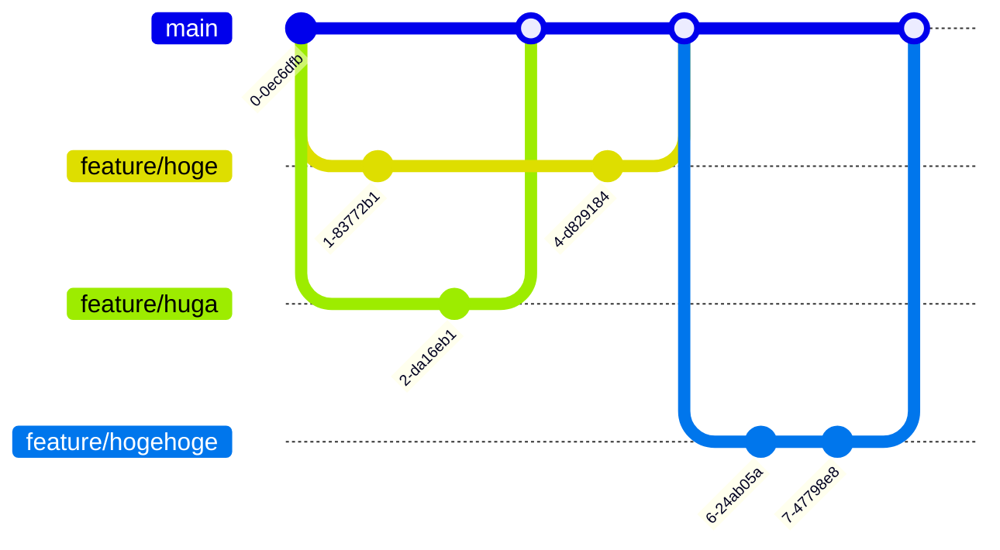

## このアプリについて

spajamの予選で使う用のアプリをあらかじめ作っておきました。

自分のブランチ切って

色々いじって遊んだりしても面白いかもしれません。

## コード解説

flutter公式のskeletonプロジェクトの説明を見ても良いのですが

多分これが一番わかりやすいので参考記事です。

https://blog.flutteruniv.com/flutter-skeleton-template/

## ブランチルール

なんか良さげなGitHubFlowってのがあったので使ってみませんか？

